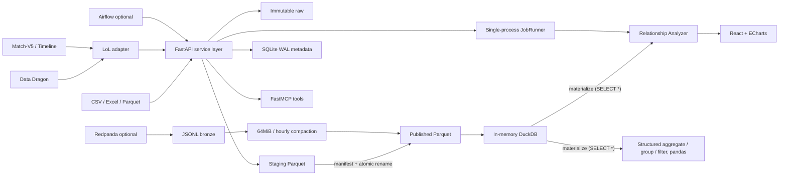

# Architecture



## 불변 조건

1. 게시 데이터는 manifest가 확정된 버전만 읽는다.
2. DuckDB는 인메모리 연결에서 Parquet를 직접 조회하여 파일 락을 공유하지 않는다.
3. SQLite는 상태·설정만 짧게 쓰며 WAL과 5초 busy timeout을 사용한다.
4. 웹과 FastMCP는 동일한 서비스/API 계약을 사용한다.
5. 스트리밍은 at-least-once 전달과 `event_id` 멱등 반영을 목표로 한다.
6. Riot 개발 키와 파생 데이터는 production 공개 환경에서 사용할 수 없다.
7. Match 참가자 식별자는 원문 대신 HMAC-SHA256 값만 Silver 이후에 게시한다.
8. 대시보드와 MCP 집계는 미리보기 행이 아니라 동일한 게시 버전 전체를 조회한다.

## 현재 구현과 목표의 차이

위 다이어그램은 데이터 흐름의 **목표**가 아니라 **현재 코드**를 그린 것이다. 아직 일치하지 않는 부분:

| 항목 | 현재 | 목표 |
|---|---|---|
| 집계·필터·그룹 | `query.materialize`로 전체 Parquet를 pandas DataFrame에 올린 뒤 pandas로 처리 (`services/bi/query.py`) | `QueryPlan`을 DuckDB SQL로 컴파일해 푸시다운 (`app/query/`) |
| 불변조건 5 | 컴팩션의 `event_id` 중복 제거가 **단일 실행 내부에서만** 동작 | 실행 간 중복 제거 |
| 파이프라인 멱등성 | 확인→제출→기록이 서로 다른 트랜잭션 | 제출 전 단일 트랜잭션 예약 |

각 항목은 `docs/parallel-plan.md`의 담당 스트림이 해결하며, 해결되면 이 표에서 삭제한다.

## 모듈 구조

```
app/main.py          앱 팩토리 (라우터 등록·미들웨어·lifespan만)
app/api/*            HTTP 라우터. 파싱 → 서비스 호출 → 반환
app/errors.py        api_errors() 컨텍스트 매니저, DomainError 계열
app/schemas/*        도메인별 Pydantic 모델 (app.schemas에서 재노출)
app/services/*       비즈니스 로직 (bi/, transforms/, lol.py, datasets.py ...)
app/query/*          DuckDB 경계: QueryPlan, materialize, schema_of
app/lol/*            순수 LoL 도메인 (FastAPI·SQLite 의존 금지)
```
